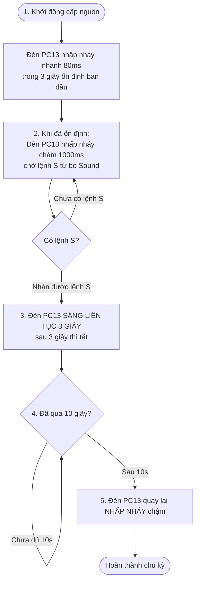

```mermaid
flowchart TD
    START(["1. Khởi động cấp nguồn"]) --> LED_FAST["Đèn PC13 nhấp nháy nhanh 80ms<br>trong 3 giây ổn định ban đầu"]
    LED_FAST --> LED_SLOW["2. Khi đã ổn định:<br>Đèn PC13 nhấp nháy chậm 1000ms<br>chờ lệnh S từ bo Sound"]
    LED_SLOW --> CHECK_S{"Có lệnh S?"}
    CHECK_S -- "Chưa có lệnh S" --> LED_SLOW
    CHECK_S -- "Nhận được lệnh S" --> LED_ON_3S["3. Đèn PC13 SÁNG LIÊN TỤC 3 GIÂY<br>sau 3 giây thì tắt"]
    LED_ON_3S --> WAIT_10S{"4. Đã qua 10 giây?"}
    WAIT_10S -- "Chưa đủ 10s" --> WAIT_10S
    WAIT_10S -- "Sau 10s" --> LED_BLINK_AGAIN["5. Đèn PC13 quay lại NHẤP NHÁY chậm"]
    LED_BLINK_AGAIN --> END(["Hoàn thành chu kỳ"])
```
