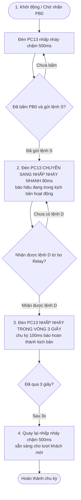

```mermaid
flowchart TD
    START(["1. Khởi động / Chờ nhấn PB0"]) --> LED_SLOW["Đèn PC13 nhấp nháy chậm 500ms"]
    LED_SLOW --> CHECK_S{"Đã bấm PB0 và gửi lệnh S?"}
    CHECK_S -- "Chưa bấm" --> LED_SLOW
    CHECK_S -- "Đã gửi lệnh S" --> LED_FAST["2. Đèn PC13 CHUYỂN SANG NHẤP NHÁY NHANH 80ms<br>báo hiệu đang trong kịch bản hoạt động"]
    LED_FAST --> CHECK_D{"Nhận được lệnh D từ bo Relay?"}
    CHECK_D -- "Chưa có lệnh D" --> LED_FAST
    CHECK_D -- "Nhận được lệnh D" --> LED_3S["3. Đèn PC13 NHẤP NHÁY TRONG VÒNG 3 GIÂY<br>chu kỳ 100ms báo hoàn thành kịch bản"]
    LED_3S --> WAIT_3S{"Đã qua 3 giây?"}
    WAIT_3S -- "Sau 3s" --> LED_RETURN["4. Quay lại nhấp nháy chậm 500ms<br>sẵn sàng cho lượt khách mới"]
    LED_RETURN --> END(["Hoàn thành chu kỳ"])
```
