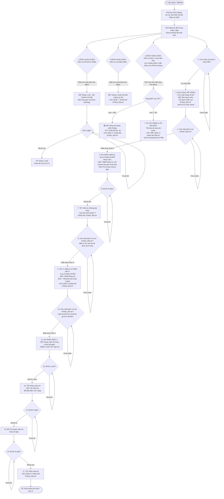

```mermaid
flowchart TD
    START(["1. Cấp nguồn / Bắt đầu"]) --> INIT["Khởi tạo GPIO (Relay A0..A6, Nút PB0, RF433 PB9) và UART"]
    INIT --> STABLE_3S["Khởi động ổn định trong vòng 3 giây<br>Toàn bộ Relay tắt hoàn toàn"]
  
    STABLE_3S --> PARALLEL{"LUỒNG SONG SONG:<br>Kiểm tra RF433 R1 (PB9)"}
    PARALLEL -- "PB9 Kích hoạt (Mọi thời điểm)" --> RF_TRIGGER["BẬT Relay 4 (A3 - ÂM THANH HÙ RÉ)<br>Đếm thời gian 10s (Non-blocking)"]
    RF_TRIGGER --> RF_CHECK{"Hết 10 giây?"}
    RF_CHECK -- "Chưa hết" --> RF_CHECK
    RF_CHECK -- "Đã đủ 10s" --> RF_OFF["TẮT Relay 4 (A3)<br>Hoàn tất chu kỳ hù ré"]

    STABLE_3S --> PARALLEL_RB6{"LUỒNG SONG SONG:<br>Kiểm tra nút RB6 (PB6)"}
    PARALLEL_RB6 -- "RB6 Kích hoạt (Mọi thời điểm)" --> RB6_TRIGGER["BẬT Relay ở chân A5 (PA5 / Relay 6) ON<br>- GỬI LỆNH 'L' SANG BO STM32_RELAY"]

    STABLE_3S --> PARALLEL_PB7{"LUỒNG SONG SONG:<br>Kiểm tra Nút 4 / Cảm biến PB7<br>(Lọc chống nhiễu 5 mẫu 50ms như PA6 bo Relay)"}
    PARALLEL_PB7 -- "PB7 Kích âm GND (Mọi thời điểm)" --> PB7_CHECK_TOGGLE{"Đang BẬT hay TẮT?"}
    PB7_CHECK_TOGGLE -- "Lần 1: BẬT" --> PB7_ON["🏆 BẬT Relay A6 (Nhạc chiến thắng)<br>- TẮT TOÀN BỘ A0..A5<br>- GỬI LỆNH 'V' SANG BO STM32_RELAY"]
    PB7_CHECK_TOGGLE -- "Lần 2: TẮT" --> PB7_OFF["🛑 TẮT HỆ THỐNG & VỀ BAN ĐẦU:<br>- Tắt toàn bộ relay âm thanh<br>- GỬI TIẾP LỆNH 'V' SANG BO RELAY<br>- Đưa về trạng thái chờ PB0"]

    STABLE_3S --> WAIT_PB0{"2. Chờ nhận nút nhấn ở chân PB0?"}
    WAIT_PB0 -- "Chưa nhấn" --> WAIT_PB0
    WAIT_PB0 -- "Có nhấn PB0" --> ACTIVATE["3. KÍCH HOẠT HỆ THỐNG:<br>- Kích chân Relay A0 lên BẬT (Âm thanh nền)<br>- Gửi lệnh S đến con STM32_RELAY<br>- Đèn PC13 nháy nhanh"]
    ACTIVATE --> WAIT_D{"4. Chờ nhận lệnh D từ STM32_RELAY?"}
    WAIT_D -- "Chưa nhận" --> WAIT_D
    WAIT_D -- "Nhận được lệnh D" --> ON_A1["5. KHI NHẬN LỆNH D:<br>- Duy trì Relay A0 BẬT (Nhạc nền)<br>- BẬT THÊM Relay A1 (Trò chuyện trên gác trong 45s)<br>- Đèn PC13 nháy trong 3 giây"]
    ON_A1 --> WAIT_45S_A1{"6. Đã đủ 45 giây?"}
    WAIT_45S_A1 -- "Chưa đủ" --> WAIT_45S_A1
    WAIT_45S_A1 -- "Đã đủ 45s" --> OFF_A1_SEND_F["7. TẮT HẲN A1 (Không bật nữa)<br>- SAU ĐÓ GỬI LỆNH 'F' SANG BO STM32_RELAY"]
    OFF_A1_SEND_F --> WAIT_G{"8. Chờ nhận lệnh G từ bo STM32_RELAY?<br>(Bất cứ lúc nào khi A6 được kích hoạt)"}
    WAIT_G -- "Chưa nhận" --> WAIT_G
    WAIT_G -- "Nhận được lệnh G" --> STEP_G["9. XỬ LÝ LỆNH G & PHẢN HỒI H:<br>- Duy trì Relay A0 BẬT<br>- BẬT THÊM Relay A2 (PA2 - Tiếng kẽo kẹt trong 5 giây)<br>- GỬI LỆNH H SANG BO STM32_RELAY"]
    STEP_G --> WAIT_J{"10. Chờ nhận lệnh J từ bo STM32_RELAY?<br>(Sau khi kết thúc chuỗi bộ gõ A5 & tắt đèn)"}
    WAIT_J -- "Chưa nhận" --> WAIT_J
    WAIT_J -- "Nhận được lệnh J" --> STEP_J1["11. KHI NHẬN LỆNH J:<br>- BẬT Relay chân A3 trong 1 phút (60 giây)<br>- ĐỒNG THỜI TẮT chân A0"]
    STEP_J1 --> WAIT_1MIN{"12. Đã đủ 1 phút?"}
    WAIT_1MIN -- "Chưa đủ" --> WAIT_1MIN
    WAIT_1MIN -- "Đã đủ 1 phút" --> STEP_J2["13. TẮT Relay chân A3<br>- BẬT LẠI chân A0<br>- Bắt đầu đếm chờ 5 giây"]
    STEP_J2 --> WAIT_5S{"14. Đã đủ 5 giây?"}
    WAIT_5S -- "Chưa đủ" --> WAIT_5S
    WAIT_5S -- "Đã đủ 5s" --> STEP_J3["15. BẬT âm thanh chân A4 trong 15 giây"]
    STEP_J3 --> WAIT_15S_A4{"16. Đã đủ 15 giây?"}
    WAIT_15S_A4 -- "Chưa đủ" --> WAIT_15S_A4
    WAIT_15S_A4 -- "Đã đủ 15s" --> STEP_J4["17. TẮT HẲN chân A4<br>- GỬI LỆNH 'K' SANG BO STM32_RELAY"]
    STEP_J4 --> FINISH(["18. Hoàn thành kịch bản / Duy trì"])
```
