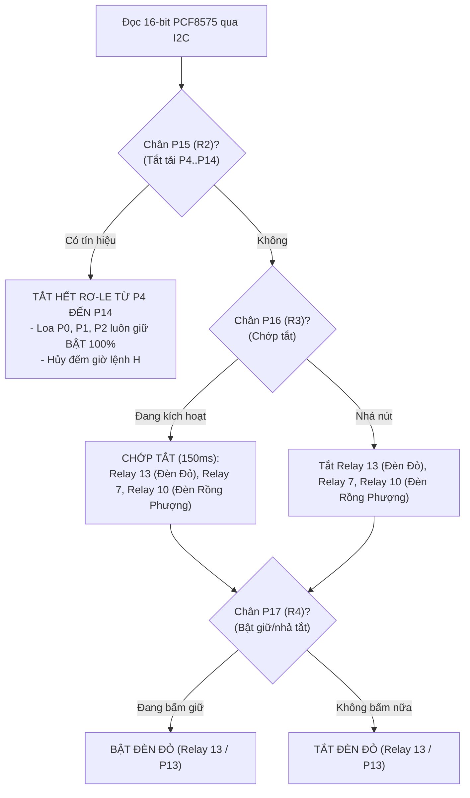

```mermaid
flowchart TD
    START(["1. Cấp nguồn / Bắt đầu"]) --> INIT["Khởi tạo I2C Open-Drain, UART, GPIO PB0 & PA6"]
    INIT --> STABLE_3S["Khởi động ổn định trong vòng 3 giây<br>Toàn bộ rơ-le tắt hoàn toàn"]
  
    STABLE_3S --> PARALLEL_V{"LUỒNG SONG SONG:<br>Nhận Lệnh 'V' từ STM32_SOUND?<br>(Kích hoạt bất kỳ thời điểm nào)"}
    PARALLEL_V -- "Lần 1 (BẬT)" --> STEP_V1["🏆 KÍCH CHIẾN THẮNG:<br>- BẬT Relay P12, P0, P1<br>- GIỮ NGUYÊN P6 (nếu đã mở)<br>- TẮT TOÀN BỘ các relay khác & chân A7"]
    PARALLEL_V -- "Lần 2 (TẮT)" --> STEP_V2["🛑 TẮT HỆ THỐNG & VỀ BAN ĐẦU:<br>- Tắt toàn bộ relay (giữ P6)<br>- Về TRANG_THAI_CHO_LENH_S<br>- Reset toàn bộ cờ kịch bản"]

    STABLE_3S --> WAIT_S{"2. Chờ nhận lệnh S từ STM32_SOUND?"}
    WAIT_S -- "Chưa có lệnh" --> WAIT_S
    WAIT_S -- "Nhận được lệnh S" --> STEP1["3. KÍCH HOẠT RELAY:<br>- BẬT P0 (Loa tổng) và P3 (LED quan sát)<br>- Các P khác tắt<br>- Bắt đầu đếm thời gian quan sát 30 giây"]
    STEP1 --> WAIT_30S{"4. Đã đủ 30 giây chưa?<br>(30s cài đặt trong config.h)?"}
    WAIT_30S -- "Chưa đủ 30s" --> WAIT_30S
    WAIT_30S -- "Đã đủ 30s" --> STEP2["5. GỬI LỆNH D SANG BO SOUND:<br>- BẬT P1 (Loa trên gác)<br>- CÒN LẠI CÁC P KHÁC TẮT (P0, P3 tắt)"]
    STEP2 --> WAIT_F{"6. Chờ nhận lệnh F từ bo Sound?"}
    WAIT_F -- "Chưa có lệnh F" --> WAIT_F
    WAIT_F -- "Nhận được lệnh F" --> STEP3["7. KHI NHẬN LỆNH F:<br>- BẬT P5 (Đèn đồ chơi)<br>- TẮT đèn P3<br>- BẬT cả P0 và P1"]
    STEP3 --> WAIT_A6{"8. Chờ chân A6 (PA6) có tín hiệu nối âm GND?<br>(Bộ xử lý ngoài kích - Luồng riêng, chỉ nhận 1 lần)"}
    WAIT_A6 -- "Chưa có tín hiệu" --> WAIT_A6
    WAIT_A6 -- "A6 nhận tín hiệu (Mức LOW)" --> STEP4["9. XỬ LÝ TÍN HIỆU A6 (CHỈ 1 LẦN DUY NHẤT):<br>- BẬT P6 (Mở cửa - KHÔNG BAO GIỜ TẮT LẠI!)<br>- TẮT đèn quan sát P3 & TẮT đèn đồ chơi P5<br>- GỬI LỆNH 'G' SANG BO STM32_SOUND<br>- Bắt đầu đếm 5s"]
    STEP4 --> WAIT_H{"10. Chờ nhận lệnh H từ bo Sound<br>hoặc đủ 5s sau A6?"}
    WAIT_H -- "Chưa đủ 5s" --> WAIT_H
    WAIT_H -- "Đủ 5s" --> STEP_H2["11. BẬT Relay 7 (Chiếu đèn 7 bức tranh)<br>- Bắt đầu đếm 45s tiếp theo"]
    STEP_H2 --> WAIT_45S{"14. Đã đủ 45 giây sau đó?"}
    WAIT_45S -- "Chưa đủ" --> WAIT_45S
    WAIT_45S -- "Đã đủ 45s" --> STEP_H3["15. BẬT ĐÈN RỒNG PHƯỢNG (P10) VÀ RELAY P3"]
    STEP_H3 --> WAIT_A5{"16. Chờ cảm biến NPN PB0 BỊ MẤT TÍN HIỆU?<br>(Sau khi đã đặt vật LOW -> nhấc vật ra HIGH)"}
    WAIT_A5 -- "Vẫn còn tín hiệu" --> WAIT_A5
    WAIT_A5 -- "Mất tín hiệu (Mức HIGH)" --> KNOCK_30S["17. BỘ GÕ P14 NHẤP NHÁY NGẪU NHIÊN 30S:<br>- 1s BẬT, 1.5s TẮT<br>- 2s BẬT, 2s TẮT<br>- 3s BẬT, 3s TẮT"]
    KNOCK_30S --> WAIT_KNOCK_30S{"Đã hết 30 giây?"}
    WAIT_KNOCK_30S -- "Chưa đủ" --> KNOCK_30S
    WAIT_KNOCK_30S -- "Đã đủ 30s" --> KNOCK_OFF["18. TẮT BỘ GÕ P14<br>- Bắt đầu đếm chờ 10s tiếp theo"]
    KNOCK_OFF --> WAIT_10S_OFF{"Đã đủ 10 giây sau đó?"}
    WAIT_10S_OFF -- "Chưa đủ" --> WAIT_10S_OFF
    WAIT_10S_OFF -- "Đã đủ 10s" --> OFF_ALL_LIGHTS["19. SAU 10S: TẮT TẤT CẢ RELAY (P0..P14)<br>- CHỈ RIÊNG DUY NHẤT CHÂN P2 BẬT<br>- GỬI LỆNH 'J' CHO BO SOUND<br>- Chờ hết bài 'Đừng bỏ em 1 mình'"]
    OFF_ALL_LIGHTS --> WAIT_50S_P2{"20. Nhận lệnh 'U' từ Sound<br>(vừa hết bài) hoặc đủ 53s?"}
    WAIT_50S_P2 -- "Chưa nhận" --> WAIT_50S_P2
    WAIT_50S_P2 -- "Nhận lệnh 'U' / Hết bài" --> STEP_TAT_P2["21. VỪA HẾT ĐỪNG BỎ EM 1 MÌNH:<br>- TẮT P2<br>- BẬT LẠI 2 LOA P0 VÀ P1 NGAY LẬP TỨC"]
    STEP_TAT_P2 --> WAIT_K{"22. Chờ nhận lệnh K từ STM32_SOUND?"}
    WAIT_K -- "Chưa nhận" --> WAIT_K
    WAIT_K -- "Nhận được lệnh K" --> STEP_K1["23. KHI NHẬN LỆNH K:<br>- Rơi Relay ở chân P11 ON (Búp bê rơi)<br>- BẬT chân P13 ON<br>- BẬT KÈM chân P0 và P1<br>- Bắt đầu đếm thời gian 30s"]
    STEP_K1 --> WAIT_30S_K{"24. Đã đủ 30 giây?"}
    WAIT_30S_K -- "Chưa đủ" --> WAIT_30S_K
    WAIT_30S_K -- "Đã đủ 30s" --> STEP_K2["25. SAU 30 GIÂY:<br>- TẮT chân P13<br>- BẬT chân P3 TRỞ LẠI"]
    STEP_K2 --> WAIT_L{"26. Chờ nhận lệnh L từ STM32_SOUND?<br>(Bất kỳ thời điểm nào)"}
    WAIT_L -- "Chưa nhận" --> WAIT_L
    WAIT_L -- "Nhận được lệnh L" --> STEP_L["27. KHI NHẬN LỆNH L:<br>- Chân A7 (PA7) STM32 xuất tín hiệu ON<br>- Kích chân THÊM P3 sáng"]
    STEP_L --> FINISH(["28. Hoàn thành kịch bản / Duy trì"])
```

---

## 📡 LƯU ĐỒ XỬ LÝ 3 KÊNH RF433 TRÊN BO RELAY (P15, P16, P17)

*Quét song song liên tục mỗi 20ms trong mọi trường hợp:*

```mermaid
flowchart TD
    POLL["Đọc 16-bit PCF8575 qua I2C"] --> CHK_P15{"Chân P15 (R2)?<br>(Tắt tải P4..P14)"}
    CHK_P15 -- "Có tín hiệu" --> ACT_P15["TẮT HẾT RƠ-LE TỪ P4 ĐẾN P14<br>- Loa P0, P1, P2 luôn giữ BẬT 100%<br>- Hủy đếm giờ lệnh H"]
    CHK_P15 -- "Không" --> CHK_P16{"Chân P16 (R3)?<br>(Chớp tắt)"}
  
    CHK_P16 -- "Đang kích hoạt" --> ACT_P16["CHỚP TẮT (150ms):<br>Relay 13 (Đèn Đỏ), Relay 7, Relay 10 (Đèn Rồng Phượng)"]
    CHK_P16 -- "Nhả nút" --> OFF_P16["Tắt Relay 13 (Đèn Đỏ), Relay 7, Relay 10 (Đèn Rồng Phượng)"]
  
    ACT_P16 --> CHK_P17{"Chân P17 (R4)?<br>(Bật giữ/nhả tắt)"}
    OFF_P16 --> CHK_P17
  
    CHK_P17 -- "Đang bấm giữ" --> ACT_P17["BẬT ĐÈN ĐỎ (Relay 13 / P13)"]
    CHK_P17 -- "Không bấm nữa" --> OFF_P17["TẮT ĐÈN ĐỎ (Relay 13 / P13)"]
```
